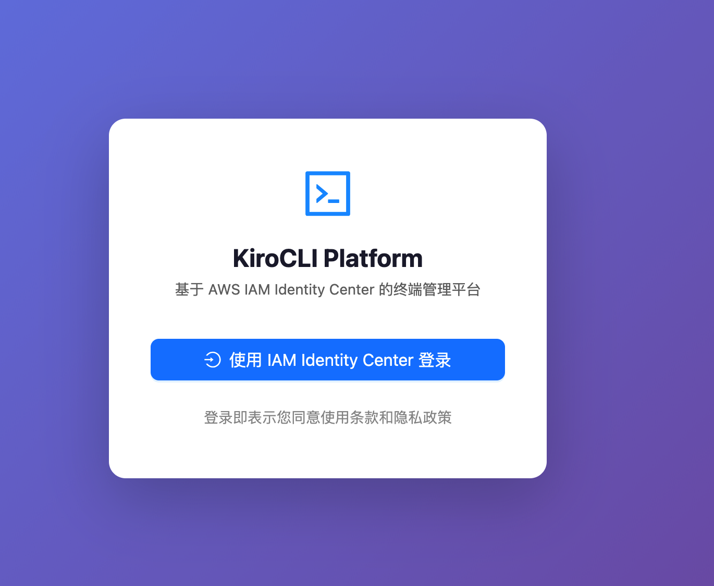
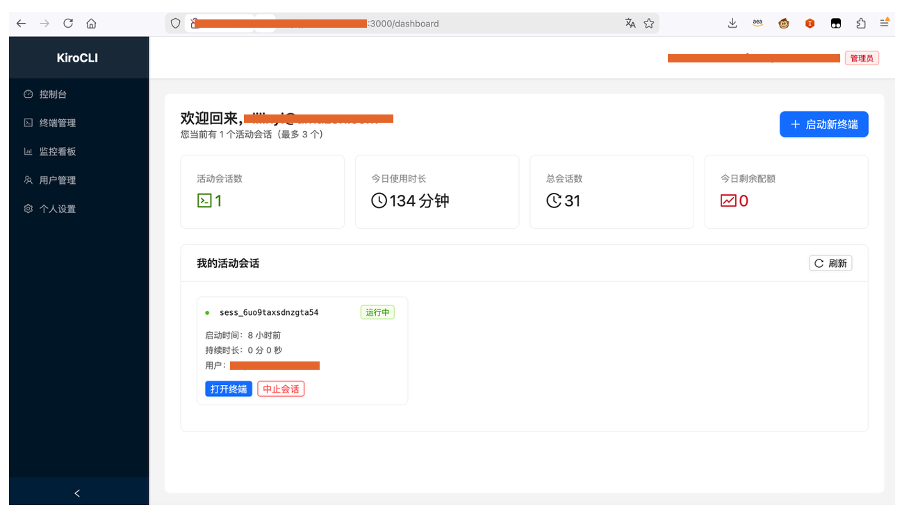
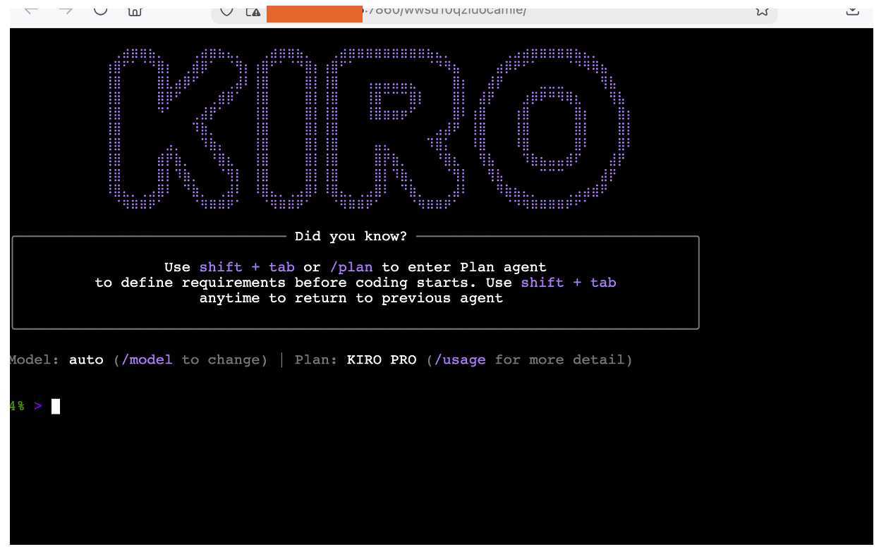

# KiroCLI Platform

> A secure, browser-based platform for managing Kiro CLI terminal sessions — powered by AWS IAM Identity Center SSO, with zero credential exposure.



---

## Why KiroCLI Platform?

Managing Kiro CLI across a team is painful. Developers need to handle AWS credentials, manage local installations, and deal with session sprawl. KiroCLI Platform solves this by centralizing access through a secure web interface.

| Challenge | Traditional Approach | KiroCLI Platform |
|-----------|---------------------|------------------|
| Authentication | Distribute AK/SK to every developer | SSO login via AWS IAM Identity Center — no credentials to manage |
| Access control | Manual IAM policy per user | Role-based groups with per-user session quotas |
| Session security | Direct CLI access, no audit trail | Random-token URLs + TLS encryption + session logging |
| Concurrent users | One CLI per machine | Up to 100 concurrent browser-based sessions per instance |
| Credential rotation | Update AK/SK on every machine | Centralized — rotate once in IAM Identity Center |

---

## Key Security Features

- **No AK/SK distribution** — Users authenticate via AWS IAM Identity Center (SAML 2.0). No AWS access keys are ever shared with end users.
- **Random-token terminal URLs** — Each Gotty session gets a 16-character cryptographically random URL token (e.g. `/abcd1234efgh5678/`). Guessing a session URL is computationally infeasible.
- **TLS encryption** — All terminal traffic between the browser and Gotty is encrypted over HTTPS/WSS. No plaintext terminal data on the wire.
- **Session isolation** — Each user gets their own Gotty process. Sessions are fully isolated and automatically cleaned up on idle timeout.
- **JWT-based API auth** — Backend APIs are protected with short-lived JWT tokens (8-hour expiry by default).

---

## Features

- **SSO Authentication** via AWS IAM Identity Center (SAML 2.0)
- **Browser-based Terminal** powered by Gotty + Kiro CLI
- **Session Management** — start, monitor, and close terminal sessions
- **User & Group Management** with role-based access control
- **Concurrent Sessions** — supports up to 100 simultaneous terminal sessions
- **Auto Cleanup** — idle sessions are automatically terminated
- **System Monitoring** dashboard with real-time metrics

---

## Screenshots

### Session Management



### Browser Terminal



---

## Architecture

```
Browser → Nginx (port 3000) → FastAPI Backend (127.0.0.1:8000)
                                      ↓
                    Gotty (ports 7861–7960, TLS) → kiro-cli
                    [each session: isolated process + random URL token]
```

All components run on a single EC2 instance. No external dependencies beyond AWS IAM Identity Center.

---

## Prerequisites

- AWS EC2 instance running **Ubuntu 22.04** (recommended: t3.medium or larger)
- AWS IAM Identity Center configured with a SAML application
- Kiro CLI installed on the EC2 instance
- EC2 Security Group inbound rules:

| Port | Protocol | Source | Purpose |
|------|----------|--------|---------|
| 22 | TCP | Your IP | SSH |
| 3000 | TCP | 0.0.0.0/0 | Web UI (Nginx) |
| 7860–7960 | TCP | 0.0.0.0/0 | Gotty terminal sessions |

---

## Step 1 — Connect to EC2

```bash
ssh -i /path/to/your-key.pem ubuntu@<EC2_PUBLIC_IP>
```

---

## Step 2 — Install System Dependencies

```bash
sudo apt update && sudo apt upgrade -y
sudo apt install -y git curl wget nginx python3 python3-pip python3-venv sqlite3

# Install Node.js 20 LTS via nvm
curl -o- https://raw.githubusercontent.com/nvm-sh/nvm/v0.39.7/install.sh | bash
source ~/.bashrc
nvm install 20
nvm use 20
nvm alias default 20
node -v  # should show v20.x.x
```

---

## Step 3 — Install Gotty

```bash
wget https://github.com/sorenisanerd/gotty/releases/download/v1.5.0/gotty_v1.5.0_linux_amd64.tar.gz
tar -xzf gotty_v1.5.0_linux_amd64.tar.gz
sudo mv gotty /usr/local/bin/gotty
sudo chmod +x /usr/local/bin/gotty
gotty --version
```

---

## Step 4 — Install Kiro CLI

Follow the official Kiro CLI installation guide, then verify:

```bash
which kiro-cli        # note the full path, e.g. /usr/bin/kiro-cli
kiro-cli --version
```

> **Important**: You must use the absolute path in the `.env` configuration. An incorrect path causes the terminal to show a black screen with "connection close".

---

## Step 5 — Create TLS Certificate for Gotty

Gotty requires a TLS certificate to serve HTTPS/WSS connections. Generate a self-signed certificate:

```bash
sudo mkdir -p /opt/kirocli-certs

sudo openssl req -x509 -nodes -days 3650 -newkey rsa:2048 \
  -keyout /opt/kirocli-certs/gotty.key \
  -out /opt/kirocli-certs/gotty.crt \
  -subj "/CN=<EC2_PUBLIC_IP>/O=KiroCLI/C=US" \
  -addext "subjectAltName=IP:<EC2_PUBLIC_IP>"

sudo chmod 644 /opt/kirocli-certs/gotty.crt
sudo chmod 640 /opt/kirocli-certs/gotty.key
sudo chown ubuntu:ubuntu /opt/kirocli-certs/gotty.key
```

Verify:

```bash
ls -la /opt/kirocli-certs/
openssl x509 -in /opt/kirocli-certs/gotty.crt -noout -text | grep -E "Subject:|Not After"
```

> **Note on self-signed certificates**: Users will see a browser warning on first visit. They need to click "Advanced" → "Proceed" once to trust the certificate. For production, use a CA-signed certificate with a domain name.

---

## Step 6 — Clone the Repository

```bash
git clone https://github.com/<YOUR_GITHUB_USERNAME>/vue-kirocli-platform.git
cd vue-kirocli-platform
```

---

## Step 7 — Configure Backend

```bash
cd backend
python3 -m venv .venv
source .venv/bin/activate
pip install -r requirements.txt
```

Create the `.env` file:

```bash
cp .env.example .env
nano .env
```

Fill in all required values (no inline comments — pydantic-settings does not support them):

```env
APP_NAME=KiroCLI Platform
ENVIRONMENT=production
DEBUG=false
SECRET_KEY=<generate with: openssl rand -hex 32>

DATABASE_URL=sqlite:////home/ubuntu/vue-kirocli-platform/backend/data.db

SAML_IDP_ENTITY_ID=<IdP Entity ID from IAM Identity Center>
SAML_IDP_SSO_URL=<SSO URL from IAM Identity Center>
SAML_IDP_X509_CERT=<certificate content without BEGIN/END lines>
SAML_SP_ENTITY_ID=http://<EC2_PUBLIC_IP>:3000/api/v1/auth/saml/metadata
SAML_SP_ACS_URL=http://<EC2_PUBLIC_IP>:3000/api/v1/auth/saml/callback

GOTTY_PRIMARY_PORT=7860
GOTTY_PORT_START=7861
GOTTY_PORT_END=7960
GOTTY_PATH=/usr/local/bin/gotty
KIRO_CLI_PATH=<absolute path from: which kiro-cli>
GOTTY_CERT_PATH=/opt/kirocli-certs/gotty.crt
GOTTY_KEY_PATH=/opt/kirocli-certs/gotty.key
GOTTY_REMOTE_MODE=false
GOTTY_REMOTE_HOST=<EC2_PUBLIC_IP>

CORS_ORIGINS=["http://<EC2_PUBLIC_IP>:3000"]

LOG_LEVEL=INFO
LOG_FILE=/home/ubuntu/vue-kirocli-platform/logs/backend.log

JWT_ALGORITHM=HS256
JWT_EXPIRATION_HOURS=8

SESSION_IDLE_TIMEOUT_MINUTES=30
SESSION_CLEANUP_INTERVAL_MINUTES=5
```

Initialize the database:

```bash
mkdir -p /home/ubuntu/vue-kirocli-platform/logs
python scripts/init_db.py
```

---

## Step 8 — Configure Backend systemd Service

```bash
sudo tee /etc/systemd/system/kirocli-backend.service << 'EOF'
[Unit]
Description=KiroCLI Platform Backend
After=network.target

[Service]
Type=simple
User=ubuntu
WorkingDirectory=/home/ubuntu/vue-kirocli-platform/backend
Environment=HOME=/home/ubuntu
Environment=USER=ubuntu
Environment=PATH=/home/ubuntu/vue-kirocli-platform/backend/.venv/bin:/usr/local/bin:/usr/bin:/bin
ExecStart=/home/ubuntu/vue-kirocli-platform/backend/.venv/bin/uvicorn app.main:app --host 127.0.0.1 --port 8000
Restart=always
RestartSec=5

[Install]
WantedBy=multi-user.target
EOF

sudo systemctl daemon-reload
sudo systemctl enable kirocli-backend
sudo systemctl start kirocli-backend
sudo systemctl status kirocli-backend
```

---

## Step 9 — Build Frontend

```bash
cd /home/ubuntu/vue-kirocli-platform/frontend

# If EC2 has less than 2GB RAM, add swap first
sudo fallocate -l 2G /swapfile
sudo chmod 600 /swapfile
sudo mkswap /swapfile
sudo swapon /swapfile

npm install
npm run build
# Success: ✓ built in xx.xxs
```

---

## Step 10 — Configure Nginx

```bash
sudo tee /etc/nginx/sites-available/kirocli << 'EOF'
server {
    listen 3000;
    server_name _;

    root /home/ubuntu/vue-kirocli-platform/frontend/dist;
    index index.html;

    location / {
        try_files $uri $uri/ /index.html;
    }

    location /api/ {
        proxy_pass http://127.0.0.1:8000;
        proxy_set_header Host $host;
        proxy_set_header X-Real-IP $remote_addr;
        proxy_set_header X-Forwarded-For $proxy_add_x_forwarded_for;
        proxy_set_header X-Forwarded-Proto $scheme;
    }

    location /ws/ {
        proxy_pass http://127.0.0.1:8000;
        proxy_http_version 1.1;
        proxy_set_header Upgrade $http_upgrade;
        proxy_set_header Connection "upgrade";
        proxy_set_header Host $host;
    }
}
EOF

sudo ln -sf /etc/nginx/sites-available/kirocli /etc/nginx/sites-enabled/
sudo rm -f /etc/nginx/sites-enabled/default

# Fix permissions to avoid Nginx 500 errors
chmod 755 /home/ubuntu
chmod -R 755 /home/ubuntu/vue-kirocli-platform/frontend/dist

sudo nginx -t
sudo systemctl restart nginx
sudo systemctl enable nginx
```

---

## Step 11 — Configure AWS IAM Identity Center

In the AWS IAM Identity Center console, update your SAML application:

| Field | Value |
|-------|-------|
| Application ACS URL | `http://<EC2_PUBLIC_IP>:3000/api/v1/auth/saml/callback` |
| Application SAML audience (Entity ID) | `http://<EC2_PUBLIC_IP>:3000/api/v1/auth/saml/metadata` |

Attribute mappings:

| User attribute in the application | Maps to | Format |
|-----------------------------------|---------|--------|
| Subject | `${user:email}` | emailAddress |
| email | `${user:email}` | unspecified |
| groups | `${user:groups}` | unspecified |

> **Note**: Subject must be `${user:email}`. Using `${user:name}` causes a "No access" error.

---

## Step 12 — Verify Gotty + Kiro CLI

Run as the `ubuntu` user (never with sudo):

```bash
gotty \
  --address 0.0.0.0 \
  --port 7862 \
  --permit-write \
  --reconnect \
  --random-url \
  --random-url-length 16 \
  --ws-origin ".*" \
  --tls \
  --tls-crt /opt/kirocli-certs/gotty.crt \
  --tls-key /opt/kirocli-certs/gotty.key \
  $(which kiro-cli)
```

Open `https://<EC2_PUBLIC_IP>:7862/<token>/` in your browser. Accept the self-signed certificate warning, and you should see the Kiro CLI terminal. Press `Ctrl+C` to stop.

> **Important**: Users must visit a Gotty HTTPS URL directly once in their browser to trust the self-signed certificate before the embedded terminal in the platform will work.

---

## Step 13 — Verify Full Deployment

```bash
sudo systemctl status kirocli-backend
curl http://127.0.0.1:8000/api/v1/health
sudo systemctl status nginx
ss -tlnp | grep -E '3000|8000'
```

Open `http://<EC2_PUBLIC_IP>:3000` in your browser. Click "SSO Login" to authenticate via AWS IAM Identity Center.

---

## Updating the Application

```bash
cd /home/ubuntu/vue-kirocli-platform
git pull origin main
sudo systemctl restart kirocli-backend
cd frontend && npm install && npm run build
```

---

## Troubleshooting

### Terminal shows black screen / "connection close"

```bash
which kiro-cli
sed -i "s|KIRO_CLI_PATH=.*|KIRO_CLI_PATH=$(which kiro-cli)|" \
  /home/ubuntu/vue-kirocli-platform/backend/.env
sudo systemctl restart kirocli-backend
```

Other causes: Security Group not open for ports 7860–7960, or kiro-cli not authenticated (run `kiro-cli` manually to complete login first).

### Backend fails to start (disk full)

```bash
df -h /
sudo apt clean
sudo journalctl --vacuum-time=3d
```

### Frontend build killed (OOM)

```bash
sudo fallocate -l 2G /swapfile && sudo chmod 600 /swapfile
sudo mkswap /swapfile && sudo swapon /swapfile
npm run build
```

### Nginx 500 error

```bash
chmod 755 /home/ubuntu
chmod -R 755 /home/ubuntu/vue-kirocli-platform/frontend/dist
sudo systemctl restart nginx
```

### SAML `invalid_response`

Verify `SAML_SP_ACS_URL` in `.env` exactly matches the Application ACS URL in IAM Identity Center. A common mistake is a duplicated `https:` prefix in `SAML_IDP_SSO_URL`.

### SAML "No access" error

Set Subject mapping to `${user:email}` with format `emailAddress`. Do not use `${user:name}`.

---

## License

MIT
